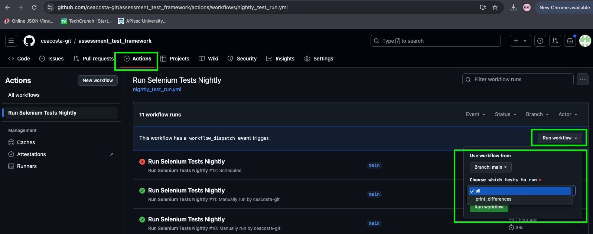
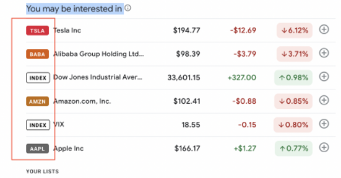

# Pre-requisites
This project was tested with 
- python 3.12

# How to run in github
1. Navigate to [Run Selenium Tests Nightly action](https://github.com/ceacosta-git/assessment_test_framework/actions/workflows/nightly_test_run.yml)
2. Click `Run workflow` dropdown
3. Use workflow from Branch: main
4. Choose which tests to run
   1. `all` runs all tests
   2. `print_differences` runs test case `5` and `6` from `Problem #1`
5. Click `Run workflow` button

   
```
Note: This workflow also runs automatically nightly at 10pm PST
```

# How to run locally
1. Clone this repo: for example
```
git clone https://github.com/ceacosta-git/selenium-google-finance.git
```
2. Navigate to `selenium-google-finance` project on your local environment: for example
```
cd ~/dev/selenium-google-finance
```
3. Use `pipenv` for setting a local virtual environment
   1. Pre-requisites: 
      1. Install `python`
      2. Install `pip`
   3. Install `pipenv` 
   ```
   pip3 install pipenv
   ```
   4. Install dependencies using `Pipfile`
   ```pipenv install```
4. Run tests
   1. Running `all` tests
   ```
   pipenv run python -m pytest --verbose --html=reports/report.html --self-contained-html -s
   ```
   2. Running `print_differences` (test case `5` and `6` from `Problem #1`)
   ```
   pipenv run python -m pytest -m print_differences --verbose --html=reports/report.html --self-contained-html -s
   ```
   

# Tech Stack
- [Python](https://www.python.org/)
- [Selenium](https://www.selenium.dev/documentation/)
- [pytest](https://docs.pytest.org/en/stable/)
- [Page Factory](https://pypi.org/project/selenium-page-factory/) 

# Test Google Finance page

## Problem Statement
Write an automated test for a web application using Python and Selenium using Page
Object and Page Factory models.

### Problem #1: 
Retrieve data from UI and compare against the following test data:`["NFLX","MSFT", "TSLA"]`

#### Instructions:
Write a test that:
1. Navigates to [Google Finance](https://www.google.com/finance) page on a `Chrome` browser.
2. Verifies the page is loaded by asserting the page title contains `Google Finance`
3. Retrieves the stock symbols listed under the `section` `“You may be interested in info”`
   
4. Compare the stock symbols retrieved from `(3)` with given test data 
5. Print all stock symbols that are in `(3)` but not in given test data
6. Print all stock symbols that are in given test data but not in `(3)`

### Problem #2:
Create GitHub Actions workflows for manually and nightly runs.

Manual workflow should have option to run full set of test or test case `5` and `6` from `Problem #1`.


## Solution
    
The main solution for `Problem #1` was implemented in [tests/google/test_finance_page.py](https://github.com/ceacosta-git/assessment_test_framework/blob/main/tests/google/test_finance_page.py)

The main solution for `Problem #2` was implemented in [.github/workflows/nightly_test_run.yml](https://github.com/ceacosta-git/assessment_test_framework/blob/main/.github/workflows/nightly_test_run.yml)

## Follow-ups
- Allow to specify `headless` or `non-headless` browser option through a `pytest` flag
- Support and specify other browsers such as `Firefox`
- Setup and run this project using Docker
- Investigate if we can run `non-headless` in github

## References
As a refresher on Selenium with python, the following references were extremely useful:
- [Getting started with Selenium](https://www.selenium.dev/documentation/webdriver/getting_started/)
- [Official Selenium python examples](https://github.com/SeleniumHQ/seleniumhq.github.io/tree/trunk/examples/python)
- [BrowserStack Guide using POM and Page Factory in python](https://www.browserstack.com/guide/page-object-model-in-selenium-python)
